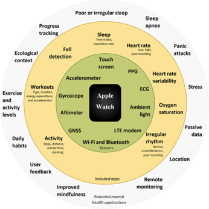

#tool
## Summary

AI-powered emotion-aware smartwatches are **advanced wearables** designed to track emotional states through biometric signals such as **heart rate variability (HRV), skin conductance, temperature fluctuations, and voice analysis**. These smartwatches leverage **machine learning models** to classify emotions, detect stress, and provide real-time interventions, making them powerful tools for **mental health monitoring, stress reduction, and social interaction enhancement**.

By analyzing **patterns of physiological arousal**, AI-enhanced wearables can recognize emotional states and suggest adaptive responses, such as **breathing exercises, guided meditation, or notifications prompting behavioral adjustments**.

## Reference Articles

- [AI-Driven Emotion Tracking in Wearable Technology](https://pmc.ncbi.nlm.nih.gov/articles/PMC9494213/)
- [The Role of AI-powered Smartwatches in Emotional Self-Regulation](https://arxiv.org/abs/2309.11097/)

## Applications & Use Cases

- **Mental Health & Personalized Therapy:** AI-powered smartwatches help individuals with stress management, emotional regulation, and early warning signs of depression and anxiety.
- **Workplace Performance & Burnout Prevention:** By monitoring real-time stress levels, these smartwatches provide micro-intervention suggestions to prevent burnout and improve focus.
- **Fitness & Emotional Well-being Tracking:** Smartwatches analyze biometric feedback during physical activity and correlate it with emotional states for a more holistic fitness assessment.
- **AI-driven Social Interaction Coaching:** Some smartwatches offer real-time feedback on social engagement, helping individuals improve emotional empathy and response timing in social settings.

## Different Sensors that enable tracking

## Discussion

- AI-powered smartwatches enhance [[Emotional Empathy]] by alerting users when their stress levels rise, helping them become more aware of emotional responses in social situations.
- These devices may fail to detect nuanced aspects of [[Theory of Mind]], which requires understanding another person's thoughts and intentions, not just emotions.
