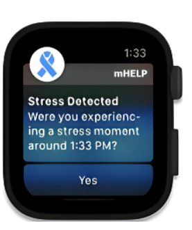

#topic
## Summary

Emotion-aware wearables and biofeedback devices represent an evolving class of **cognitive augmentation tools** designed to enhance emotional self-awareness, regulation, and [[Empathy|empathy]]. These devices leverage **biometric sensors, artificial intelligence (AI), and neurofeedback mechanisms** to provide real-time emotional insights and interventions.

By tracking **heart rate variability (HRV), electrodermal activity (EDA), brainwave patterns (EEG), and voice tone**, these devices help users regulate emotions, manage stress, and even **improve interpersonal communication** by fostering empathy-driven feedback mechanisms.

## Applications

- **Mental Health & Therapy:** Devices like [[Biofeedback Wearables for Stress & Anxiety|biofeedback headbands]] and [[AI-powered Emotion-Aware Smartwatches|emotion-tracking smartwatches]] help individuals regulate stress, anxiety, and emotional well-being.
- **Workplace Productivity:** Smart wearables that track stress levels to optimize workload and engagement.
- **Education & Learning:** Biofeedback tools for students to manage anxiety and improve focus during learning.
- **Gaming & Entertainment:** Adaptive gaming experiences that respond to a player's emotional state.
- **Social Interaction & Empathy Training:** Devices aiding in [[Cognitive Empathy]] and [[Emotional Empathy]], improving communication and interpersonal relationships.

## Emotion-Aware Smartwatch in Action

Wearable devices such as emotion-aware smartwatches continuously monitor physiological signals and provide real-time biofeedback-based interventions.

## Key Technologies & Supporting Research

- [[Biofeedback Wearables for Stress & Anxiety]]
- [[EEG-based Emotion Recognition Systems]]
- [[AI-powered Emotion-Aware Smartwatches]]

